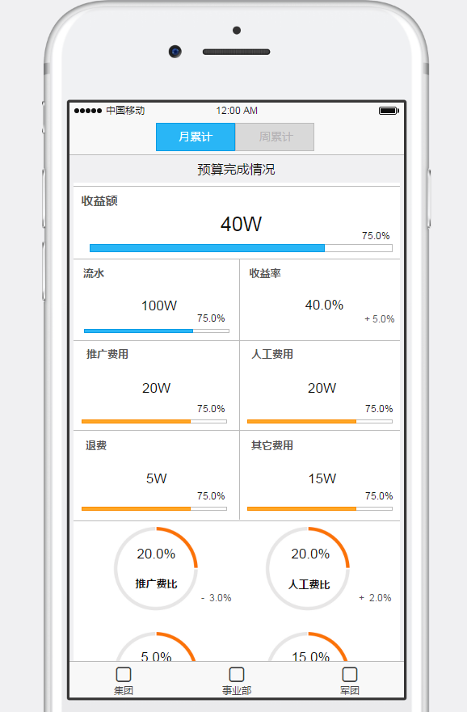

# 微信报表项目

> 本项目用的react-redux-antd技术栈，以图表的方式将销售额、流水等数据展示出来，数据都是本地mock数据。详细需求见[这里](https://modao.cc/app/a02c9facead23371bb1b5f3efe87e643d1907bb7)




## 安装package

```
npm install
```

## 运行

```
npm start
```

## 编译

```
npm run dist
```

会把源代码编译到`/dist`目录下

## 文档结构

```
webapp-
	cfg-  //webpack各种配置目录
		base.js //webpack基础配置
		defaults.js //webpack配置常量
		dev.js //webpack dev配置
		dist.js //webpack 编译配置
		test.js //webpack 自动化测试配置
	dist- //最终编译的目录
		assets/  //包括了编译后的css、js
		index.html  //编译后的spa的入口页面
	src-  //代码目录
		common 通用工具目录
		components //Dumb/Presentational Components目录
		constants //常量目录
		containers //Smart/Container Components目录
		images //图片目录
		reducers- //reducer目录
			index.js //reducer加载器
		sagas- //saga目录
			index.js //saga加载器
		styles- //样式目录
			less //less目录
		testdata //mock数据目录
		index.html //WebpackDevServer启动时候的页面
		index.js //程序入口，在cfg/dev.js中entry中定义了index bundle引用这个文件
		index_dist.html //编译的页面，最终这个页面会被编译生成dist/index.html
		routers.jsx //react-router路由的配置文件，在src/index.js中为react-router的<Router>设置
	test //测试用例目录
	.babelrc //babel配置文件
	.eslintrc //eslint配置文件
	.gitignore //git ignore文件
	build.sh //执行编译的入口shell
	karma.conf.js //karma配置文件
	package.json //不解释
	README.md //你现在阅读的文字都放在这个文件中
	server.js //启动WebpackDevServer服务
	webpackconfig.js //webpack配置文件
```